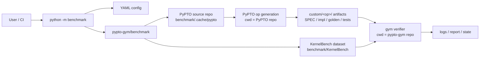
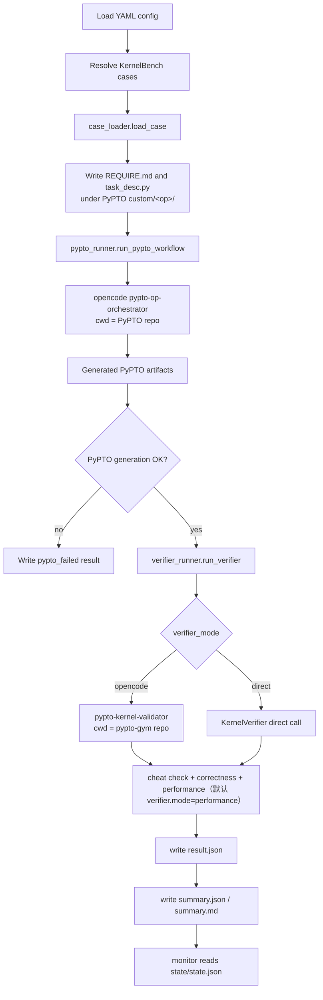
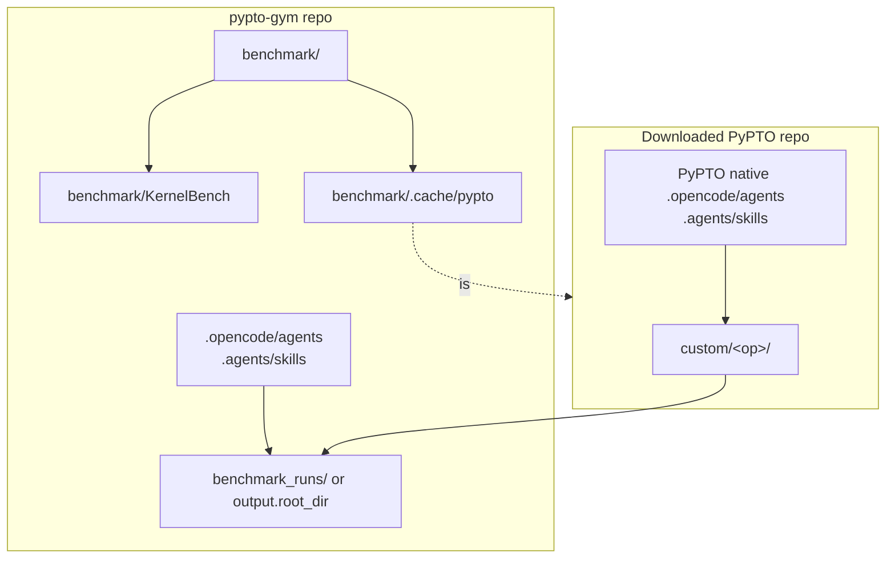

# Architecture

本文档说明 `pypto-gym` benchmark 的模块边界、端到端流程和主要产物位置。

## 设计目标

benchmark 的核心目标是把 PyPTO 算子生成和 gym 侧验证解耦：

- PyPTO 源码仓只作为算子生成工作仓使用。
- KernelBench case、调度、验证、报告和监控逻辑保留在 `pypto-gym/benchmark` 中。
- verifier 不向 PyPTO 仓复制 gym 侧代码，也不依赖 PyPTO 仓内 benchmark 或验证脚本。
- 对外入口保持为 `python -m benchmark`，运行参数统一来自 YAML。

## 边界关系

## 端到端流程

## 主要模块

| 模块 | 职责 | 运行位置 |
| --- | --- | --- |
| `benchmark.__main__` | 公开 CLI：`run`（默认 fork 后台 + 预检 + 自动 monitor，可关闭自动附着）/ `monitor` / `summary` | `pypto-gym` |
| `run_kernelbench.py` | 批处理调度、并发、状态写入、报告汇总 | `pypto-gym` |
| `case_loader.py` | 读取 KernelBench case，生成 `CaseSpec`、`REQUIRE.md` 和 `task_desc.py` | `pypto-gym` |
| `pypto_runner.py` | 启动 PyPTO 7 阶段工作流 | 子进程 cwd 为 PyPTO 仓 |
| `verifier_runner.py` | 选择 opencode verifier 或 direct verifier | `pypto-gym` |
| `verifier/` | 反作弊、精度验证、性能验证的内部实现 | `pypto-gym` |
| `monitor.py` | 渲染运行状态看板 | `pypto-gym` |
| `report.py` | 写入 case 结果和批次汇总 | `pypto-gym` |

## 运行目录

## 产物位置

| 产物 | 默认位置 | 说明 |
| --- | --- | --- |
| PyPTO 源码仓 | `benchmark/.cache/pypto/` | 由 `download_pypto.sh` 下载，仅用于生成阶段 |
| KernelBench 数据集 | `benchmark/KernelBench/` | 仓内内置完整 case 集，保留上游原始编号 |
| 算子生成产物 | `benchmark/.cache/pypto/custom/<op>/` | PyPTO 工作流生成的实现、golden、测试和状态文件 |
| 批次报告 | `<output.root_dir>/report/` | `summary.json`、`summary.md` 和单 case 结果 |
| 运行状态 | `<output.root_dir>/state/state.json` | `monitor` 子命令读取该文件 |
| 原始日志 | `<output.root_dir>/report/<level>/<op>/` | `pypto_run.log`、`verifier.log` 和会话导出 |
| PyPTO custom 副本 | `<output.root_dir>/custom/<level>/<op>/` | 与 `report/` 同级，便于单独打包报告；复制时排除 `output*` |
| 断裂点综合分析 | `<output.root_dir>/report/fracture-points/` | benchmark 结束后的可选后处理产物，见 `docs/fracture-analysis.md` |
| 后台 run 子进程日志 | `<output.root_dir>/logs/benchmark.out` / `benchmark.err` | 默认 detached 时子进程标准输出与错误流 |

## 隔离原则

生成阶段和验证阶段的隔离规则如下：

- `download_pypto.sh` 只负责下载/更新 PyPTO master，不复制 `pypto-gym` 代码到 PyPTO 仓。
- `pypto_runner` 可以在 PyPTO 仓下运行 `pypto-op-orchestrator`，并把生成产物写入 PyPTO 仓的 `custom/<op>/`。
- `verifier_runner` 在 `pypto-gym` 仓下运行 validator，读取 PyPTO 生成产物进行验证。
- `pypto-gym` verifier 不要求 PyPTO 仓内存在 benchmark 包、validator skill 或 gym 自定义 agent。
- 默认 benchmark case 内置在 `benchmark/KernelBench/`；自定义实验 case 可通过 `bench_dir` 指向外部 KernelBench 布局目录。
