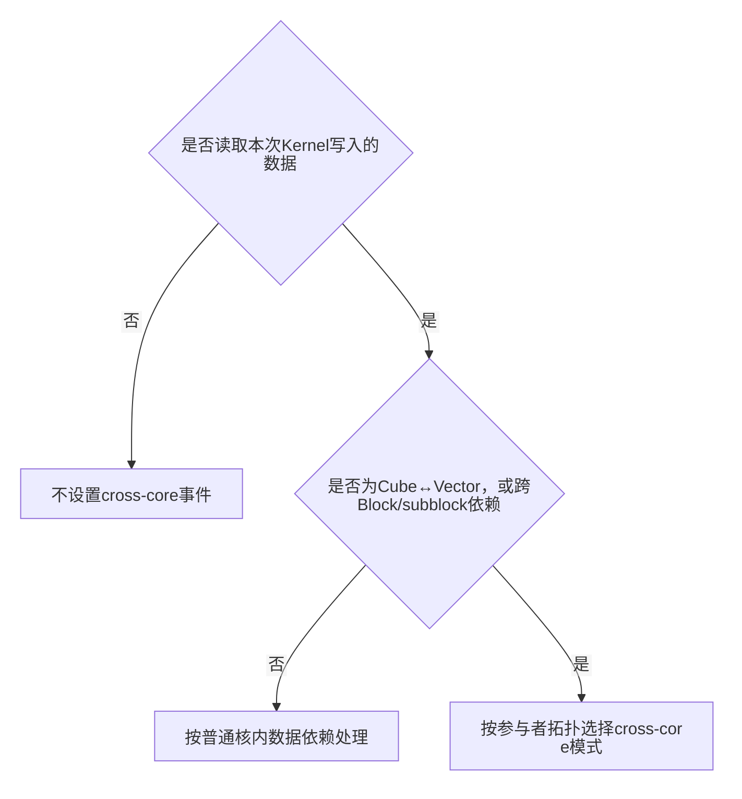
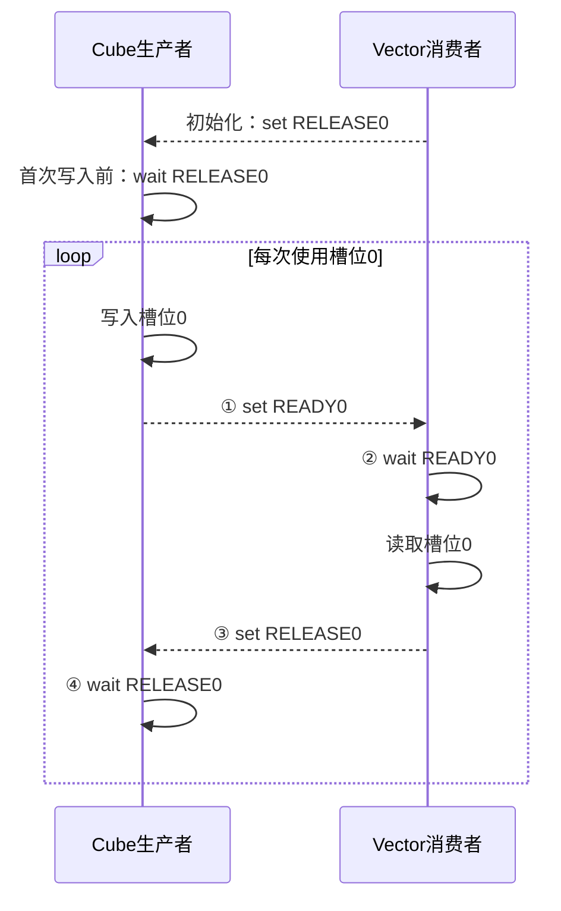

# 跨核（cross-core）同步设计

本文包含以下内容：

- 判断是否需要cross-core同步，并设计手动同步方案。
- 根据数据路径确定同步点和pipe，规划`event_id`。
- 设计单向同步和缓冲复用时的双向同步，并检查事件配对。

`pl.system.set_cross_core`和`pl.system.wait_cross_core`用于保证生产者和消费者之间的数据读写顺序。最常见的场景是同一个AI Core block内，Cube执行域与Vector执行域协同处理一组中间数据；接口也提供跨Block或subblock的同步模式。同步事件只传递“可以继续执行”的信号，不负责搬运数据，也不分配共享缓冲。

设计跨核同步时，先确定中间数据存放在GM workspace、Mat（L1）还是Vec，再确定生产者和消费者，最后放置set/wait并分配`event_id`。接口参数见`$PYPTO_DEVKIT_DIR/docs/pypto_pro/api/SIMD-API/operation/synchronization/set_cross_core_wait_cross_core.md`。

## 判断是否需要cross-core同步

消费者读取本次Kernel中由另一个执行域或另一个Block/subblock写入的数据时，需要设计cross-core同步。可以按下面的顺序判断：



数据依赖没有跨Cube/Vector执行域，也没有跨Block/subblock时，按普通核内依赖处理：带非空`mutex_ids`的TileGroup由`auto_mutex`管理跨Pipe依赖；未配置`mutex_ids`时，按实际数据路径手工插入核内同步。VF函数中的局部内存读写顺序使用`vf.mem_bar`；配置了`matmul phase`时，M与FIX之间由`unit_flag`配对。这些机制不生成Cube与Vector之间的事件，`mutex_id`也不能替代cross-core使用的`event_id`。

Cube写出中间结果后由Vector读取，或者Vector准备数据后由Cube读取，都需要cross-core同步。多个逻辑Block只写各自独立的输出区域时不需要同步；跨Block共享状态应根据算法使用原子操作、分阶段Kernel或目标产品支持的`INTER_BLOCK`同步。

Cube与Vector循环复用同一组缓冲时，必须同时建立正向同步和反向同步。正向同步保证消费者在数据写完后再读取，反向同步保证生产者在消费者读完后再覆盖该缓冲。只建立正向同步无法保护正在被消费的数据，可能导致后续写入覆盖尚未读完的数据。事件的放置和配对规则将在“缓冲复用时的双向同步”中说明。

## 手动同步

当前跨核同步统一使用`set_cross_core`和`wait_cross_core`。生产者在最后一个写操作之后set，消费者在第一个读操作之前wait；循环复用同一槽位时，还要增加消费者到生产者的反向事件。

## 明确共享TileGroup的槽位

TileGroup既可以通过`next()`、`current()`、`previous()`访问，也可以用`group[i]`直接选择槽位。`group[i]`不读取也不推进轮转游标；`i`可以是运行时整数表达式，但框架不会自动取模。设计时要明确写出槽位表达式，并证明所有运行时取值都在`[0, depth)`。

手动同步复用同一个多槽缓冲时，生产者、消费者以及READY/RELEASE事件必须指向同一个逻辑槽位。先定义槽位映射，再让两侧按同一映射访问：

```text
slot_idx = task_idx % depth
tile = shared_group[slot_idx]
READY = READY_IDS[slot_idx]
RELEASE = RELEASE_IDS[slot_idx]
```

这是一条手动同步的设计关系，不表示`mutex_id`与`event_id`变成了同一种资源。`group[slot_idx]`选中的Tile仍可携带mutex元数据，由`auto_mutex`处理各Section内部的跨Pipe依赖；READY和RELEASE仍由cross-core事件处理Section之间的顺序。

继续使用`next()`也可以，但设计文档必须证明生产者与消费者的访问次数、初始游标和分支路径会选中同一个物理槽位。存在预取、尾块分支、两侧循环次数不同或同一轮同时访问多个槽位时，显式下标通常更容易核对。下标访问不会改变游标；与`next()`混用时，两套状态要分别推导。

## 根据数据路径确定同步点

`pipe`表示执行`set`或`wait`的硬件流水，不表示Section名称。发送和等待两侧可以使用不同pipe，取值由同步点紧邻的数据操作决定。

`pipe`必须与同步点相邻的数据操作一致。Cube将Acc写入GM workspace、Vector再从GM加载到UB时，使用`FIX → MTE2`；Cube将Acc搬到Vec后由Vector计算时，使用`FIX → V`；Vector通过MTE3写入Mat、Cube再搬入L0时，使用`MTE3 → MTE1`。具体接口规定其他pipe时，以该接口文档为准。

以下片段只展示Cube整体写完workspace后通知Vector的单向事件位置，Tile和Tensor声明已省略：

```python
with pl.section_cube():
    ...
    pl.store(workspace, acc_tile, [m_off, n_off])
    pl.system.set_cross_core(
        pipe=pl.PipeType.FIX,
        event_id=0,
        sync_mode=pl.CrossCoreSyncMode.INTRA_BLOCK,
    )

with pl.section_vector():
    pl.system.wait_cross_core(
        pipe=pl.PipeType.MTE2,
        event_id=0,
        sync_mode=pl.CrossCoreSyncMode.INTRA_BLOCK,
    )
    pl.load(vec_tile, workspace, [m_off, n_off])
    ...
```

上例是一条单向依赖。如果Cube在循环内逐槽位生产，而Vector逐槽位消费，事件也必须按相同粒度建立；把唯一的`set`放在生产循环之后，只能形成“Cube全部结束后Vector整体开始”的阶段屏障，不能实现逐Tile流水。

发送和等待两侧的`sync_mode`必须一致。AIC与两个AIV子核协同使用`INTRA_BLOCK`：AIC向Vector发送的事件供两个AIV子核分别等待，AIC等待Vector事件时需要等待两个AIV子核都完成。两个AIV子核之间使用`INTER_SUBBLOCK`；跨物理block同步使用`INTER_BLOCK`；只与一个AIV子核同步时使用`UNICAST_BLOCK`。`INTER_BLOCK`和`UNICAST_BLOCK`必须同时满足目标产品与算法的适用条件。

## 规划event_id

当前接口的`event_id`范围为`[0, 16)`。一对set和wait必须使用相同的ID与`sync_mode`。一个set发送后，在对应wait消费该信号之前，event_id不得分配给可能产生错配的另一条事件。

### 单向同步

一次性workspace或每轮使用独立地址时，只需建立生产者到消费者的READY事件。生产者在完成写操作后发送READY，消费者在读取数据前等待同一个READY。wait可以先执行并阻塞，直至配对的set到达。

```text
时间向下

Cube/FIX（生产者）                 Vector/MTE2（消费者）
写workspace
set READY0  ---------------------> wait READY0
                                   读workspace
```

READY保证Vector不会在Cube写完之前读取workspace。每轮使用不同地址时，Cube不再覆盖Vector正在读取的数据，因此不需要反向事件。

### 缓冲复用时的双向同步

生产者和消费者循环复用同一组缓冲时，还需要反方向的RELEASE事件。READY表示“本轮数据已经写好”，RELEASE表示“上一轮数据已经读完，这个槽位可以再次写入”。下图以槽位0为例，展示该槽位每次写入、读取和释放的顺序，时间自上而下。



循环开始前，Vector发送初始RELEASE，Cube等待该事件后获得槽位0的首次写入权限。每次使用该槽位时，Cube写完后发送READY，Vector等待READY后读取数据，并在读取完成后发送RELEASE。槽位0仍需复用时，步骤④位于下一次写入之前；槽位0不再复用时，步骤④位于Cube侧结束之前，用于确认最后一次读取已经完成。ping-pong缓冲的槽位1采用相同过程，并使用另一组`event_id`。

循环前的RELEASE为生产者提供首次写入权限，循环中的RELEASE保护下一次复用。也可以不预发初始RELEASE，此时生产者第一次写入不等待，从第二次使用该槽位开始等待。初始化、循环主体和循环结束必须采用同一套配对方式。

事件表按“共享缓冲+槽位访问+数据方向”记录事件。以下示例把每个物理槽位直接写开；如果源码使用动态下标，表中还应补充统一的`slot_idx`表达式：

| 事件组 | 共享缓冲及访问 | 方向 | 槽位 | event_id | set位置/pipe | wait位置/pipe | 复用条件 |
|---|---|---|---:|---:|---|---|---|
| `QK_READY` | `qk_group[0]` | Cube→Vector | 0 | 0 | FIX写槽位0后 | V读槽位0前 | 对应wait已消费 |
| `QK_READY` | `qk_group[1]` | Cube→Vector | 1 | 1 | FIX写槽位1后 | V读槽位1前 | 对应wait已消费 |
| `QK_RELEASE` | `qk_group[0]` | Vector→Cube | 0 | 2 | V读槽位0后 | FIX覆盖槽位0前 | 对应wait已消费 |
| `QK_RELEASE` | `qk_group[1]` | Vector→Cube | 1 | 3 | V读槽位1后 | FIX覆盖槽位1前 | 对应wait已消费 |

前一个信号由配对wait消费后，event_id才可以复用。前一个信号尚未消费时，新的逻辑通道必须使用其他ID。动态event表达式的所有运行时取值都必须位于`[0, 16)`。

`event_id`与TileGroup的`mutex_id`属于两套独立机制，应分别规划。二者数值相同不会自动建立联系，也不能相互替代。

Cube退出或进入后续阶段前需要确认Vector已经读完最后一批数据时，Cube必须在Section末尾等待仍在使用的槽位发送RELEASE。Section开头的wait只能消费预发信号或上一轮信号，不能代替末尾等待。

每一次wait都必须对应同一方向、同一槽位和同一轮次的set；event_id复用前必须保证旧信号已经消费。wait可以先执行并阻塞，但所有执行路径都必须保证配对set最终执行，且两侧的等待关系不能形成循环。采用预发RELEASE的双向协议时，每个槽位的初始RELEASE set与第一次写前wait配对；循环中的RELEASE set与后续复用前wait配对；最后一次RELEASE set与Section末尾确认最后一批消费完成的wait配对。READY和RELEASE都必须按槽位、轮次逐一对应，指令总数相等也不能代替这项检查。

## 记录并验证同步方案

同步方案应记录共享数据对象、set/wait位置、pipe、`sync_mode`、event_id和事件复用条件。共享对象是多槽TileGroup时，还要记录缓冲深度以及生产者、消费者的槽位访问表达式。完成设计后按以下顺序检查：

1. 检查槽位映射。对同一逻辑任务，确认生产者和消费者最终选中同一个物理槽位，READY/RELEASE也按该槽位选ID。动态下标的所有取值必须位于`[0, depth)`；使用`next()`时要把初始游标、调用次数和分支影响写清楚。
2. 检查事件位置。对照READY/RELEASE配对图中的①～④，确认READY的set位于最后一个生产操作之后，READY的wait位于第一个消费操作之前，RELEASE的set位于最后一个消费操作之后，RELEASE的wait位于下一次覆盖之前。需要确认最后一次消费完成时，对应的RELEASE wait位于Cube侧结束之前。
3. 检查配对关系。每个wait都应明确对应哪个方向、哪个槽位和哪一轮的set。set可以晚于wait到达，但在所有执行路径上都必须最终执行，整个等待关系不能形成环。
4. 检查执行次数。设某槽位使用$n$次。预发初始RELEASE时，初始授权和$n$次消费完成通知共执行$n+1$次set；首次写前、$n-1$次复用前和末尾确认共执行$n+1$次wait。不预发初始RELEASE时，RELEASE方向执行$n$次set和$n$次wait：第一次写不等待，后续$n-1$次写前等待，末尾再等待最后一次消费完成。两种方案的READY方向都是$n$次set和$n$次wait。
5. 检查边界分支。零次、一次、整除和尾块迭代中的每个wait都必须能够获得配对信号。任一侧因条件分支少执行一次，都可能造成永久等待或遗留信号；零次使用的槽位还要检查预发信号是否会影响后续event_id复用。
6. 检查参与者。Vector侧有两个subblock时，应记录各自访问的地址范围。使用`INTRA_BLOCK`时，Cube等待两个AIV子核都完成；使用`UNICAST_BLOCK`时，只等待参与该事件的AIV子核；两个AIV子核之间的屏障使用`INTER_SUBBLOCK`。

上述计数按每个槽位的源码执行次数统计。使用`INTRA_BLOCK`时，还要分别核对两个AIV子核的实际执行情况。

## 官方指定算子示例

下面这些示例来自PyPTO Pro工作流维护的官方指定算子清单，路径均相对于`$PYPTO_DEVKIT_DIR`。实际设计时以`PRO_MATERIAL_INDEX.md` §B中存在的文件为准，并优先选择与目标算子缓冲数量、数据方向和循环拓扑相近的示例。

| 示例 | 适合核对的同步结构 |
|---|---|
| `pro_ops/lightning_indexer/test_quant_lightning_indexer_vf.py` | Cube与Vector之间的双向READY/RELEASE、ping-pong槽位和Cube侧末尾等待 |
| `pro_ops/fa/test_fa_tilingkey_attn_mask.py` | QK、P、PV多组跨Section数据依赖，以及按槽位分配正反向事件 |
| `pro_ops/fa/test_fa_perf_tkv_preload_dn_vf_bufid_dynrank.py` | 动态循环中的Cube/Vector协作、预发反向事件、双缓冲复用和最后一批消费确认 |
| `pro_ops/fa/test_fa_with_mask.py` | mask分支下的多组事件、双缓冲与三缓冲并存，以及不同pipe上的set/wait位置 |

这些示例用于核对完整同步协议，不是`event_id`、pipe或缓冲深度的固定模板。设计时必须按本算子的生产者、消费者、槽位和循环次数重新推导事件表；单个接口的`pipe`与`sync_mode`约束仍以当前API文档为准。
