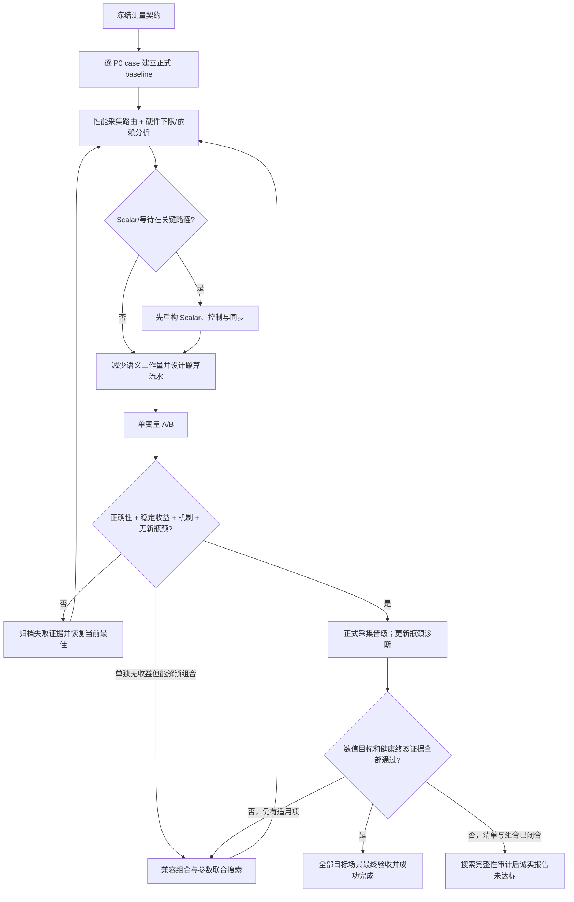

# Stage 5 精炼性能优化实战指南

> 本页是 Stage 5 从正式 baseline 到最终验收的实战检查表。完成正式 baseline 后、提出第一个候选前完整读取，并把命中的条目写入优化思路检查表。本页不替代主 Skill 的正确性、Golden 目标、正式 compare 或 verifier 门禁。

精确采集命令与证据目录见 [Stage 5 证据协议](evidence-protocol.md)（既有 msprof 流程见 [msprof 指南](msprof-guide.md)），字段和来源阈值边界见 [CSV 字段参考](csv_fields_reference.md)；设备明确为 A5 时才按需读取 [A5 Roofline 与杠杆](a5-roofline-and-levers.md)。实现方法必须回到当前算子的 SPEC、源码、生成物、正式 profiling 和 PyPTO-Pro 官方资料验证。

## Contents

1. [冻结测量契约](#1-冻结测量契约)
2. [建立基线与逐 case 灵敏度](#2-建立基线与逐-case-灵敏度)
3. [用 profiling 路由瓶颈](#3-用-profiling-路由瓶颈)
4. [优先消灭 Scalar 关键路径](#4-优先消灭-scalar-关键路径)
5. [建立 Load–Compute–Store 流水](#5-建立-loadcomputestore-流水)
6. [优先减少语义必需工作量](#6-优先减少语义必需工作量)
7. [先单变量归因，再联合搜索](#7-先单变量归因再联合搜索)
8. [候选四道晋级门](#8-候选四道晋级门)
9. [完成与穷尽的停止条件](#9-完成与穷尽的停止条件)



## 1. 冻结测量契约

第一次性能采集前，在 `PERFORMANCE_REPORT.md` 固定并记录：

- 被测实现与 runner 的 Git commit、worktree diff/可恢复副本，以及外部 benchmark 仓库的 revision（若存在）；
- 物理 device id、设备型号、健康状态和竞争进程；
- CANN、PyPTO-Pro、torch、torch_npu 版本，以及实际解析到的模块/安装路径；制品系统已经提供 wheel/安装包 digest 时一并记录；
- 影响编译、设备选择、输入和性能的环境变量；
- `PERFORMANCE_CASES.json` 原始身份、case 语义、输入分布、shape/dtype、seed、selector；
- 精度标准、比较方式、warm-up、repeats、聚合方法、exact `Op Name` 和计时范围；
- baseline/final 要使用的正式协议，以及只用于筛选的 quick 协议。

以下样本不得进入性能结论：设备告警或复位、同卡竞争、温度/频率异常、runner 超时、profiler 失败、target 归属不唯一、CSV 不完整、精度未执行或未通过。把它们记录为环境/证据状态，而不是把时延当成一次慢样本参与聚合。

final correctness、final formal compare 与 supplemental timeline 必须连续针对同一最终实现执行；中途修改 runner 或其导入实现后，重新执行这三步。

## 2. 建立基线与逐 case 灵敏度

对每个 P0 case 分别记录：

- baseline target-kernel 时延与原始 repeats；
- 用户目标差距，或默认 `golden_reference_ratio` 的差距；
- 正确性结果与容差/匹配率；
- 当前 launch/block 配置、tile/valid shape（若实现使用）、tail、输入分布和主瓶颈路由；
- 若 SPEC 定义了分数，记录该 case 对总分的真实权重/贡献；没有分数权重时不得自行编造。

候选排序不只看“谁最慢”，也不只挑“谁最容易”。使用以下优先级思想：

```text
priority(case, lever)
  = 对验收指标的预计改善
    / 实现、编译、正确性与 profiling 的预计成本
```

- 有正式评分函数时，“预计改善”使用该 case 的真实权重与预计分数增量；
- 目标是全场景门禁时，优先缩小最差场景的目标差距；候选仍按全部目标场景的等权平均加速比排序，逐场景回退必须披露，且最终不得导致任一场景目标失败；
- 预计收益只能用于排序，不能代替实际代码实验；
- case 优先级只决定执行顺序，不能改变 final 的 all-P0 覆盖。

## 3. 用 profiling 路由瓶颈

至少读取 target 的 Vector/Cube、Scalar、MTE2、MTE3、GM/UB/L2、Task Duration、AIC/AIV 核时，以及可归属时的 block/逐核利用率。先形成“候选路由”，再用 Roofline、受控 A/B 和 timeline 确认终态：

| 观察 | 初步路由 | 必须补的证明 |
|---|---|---|
| Vector 或 Cube 占主要份额 | `compute_candidate` | 有效工作量/适用峰值、指令构成、减工作量 A/B |
| MTE2/MTE3 主导，或对应层带宽接近当前访问形态的可证上界 | `data_movement_candidate` | 必要字节、复用/缓存层级、只搬运或布局 A/B |
| Scalar、地址/descriptor、branch 或同步准备主导 | `scalar_candidate` | hot region、循环/依赖证据及重构 A/B；不可作为可接受终态 |
| 各 pipe 都低 | `scheduling_or_parallelism_candidate` | 同步/依赖 DAG、launch 与固定开销、block 数、尾核和逐核离散度 |

约束：

- 单个或多个 ratio 高只说明“时间花在何处”，不证明已经到 Roofline；
- 在 schema、目标 task 和计时范围均已确认时，多个 pipe ratio 之和明显超过 100% 可作为“可能存在重叠”的线索，也可能来自计数口径；不能据此写 `pipeline_evidence=proven`；
- 只有 final 的唯一 exact target 时间窗、同一 BIU lane 的区间证据，再与当前相邻 Tile、slot 和 stage DAG 对应，才能证明搬算重叠；
- 不同 lane/core 同时运行是 block 级并行，不能冒充单核 Load–Compute–Store 流水。

## 4. 优先消灭 Scalar 关键路径

Scalar 指令无法也无需归零；不可接受的是可避免的 Scalar、同步等待、地址或控制准备成为关键路径。优先排查：

- 生成物中的 get/set-value 类标量往返，或 reduction 结果落 Tile 后又经 Scalar 广播；
- per-element、per-row、per-rank 的标量循环和 branch；
- 动态小循环的回边与反复 VF 启停；
- 每个 tile 重复计算 shape、axis、mask、地址、descriptor 或 candidate merge；
- 不必要的 Vector↔Scalar、load↔compute、compute↔store 同步；
- tile 过小导致固定 setup/轮转成本无法摊薄。

按语义与公开 API 能力依次尝试：

1. 将 shape、axis、满 mask、分支条件等循环不变量提升到多行/多 tile 共享；
2. 将数据并行的 compare/select/reduce/merge 移到 Tile-level API 或合法 VF 内完成；
3. 把逐行分支提升到 owner、stage 或有限 TilingKey 级；
4. 静态展开确定且很小的控制网络，避免动态回边；
5. 使用 Vector/多 accumulator 累计，最后只做一次必要 reduction；
6. 增大合法 tile 或一次处理多行/多 batch，减少 setup 次数；
7. 快路只覆盖已证明的前置条件；条件不成立时保留精确、完整的通用 fallback。

每项都要重新检查寄存器压力、UB 容量、tail、数值次序和全部 P0 case；“Scalar ratio 降低”本身不是接受理由，最终 Task Duration 与正确性必须同时改善。

## 5. 建立 Load–Compute–Store 流水

稳态目标是让不同 work item 形成：

```text
MTE2 load(tile N+1)
    与 compute(tile N)
    与 MTE3/store(tile N-1)
在合法依赖范围内重叠
```

PyPTO-Pro 落地检查：

- 用不同 TileGroup slot 表达相邻迭代的输入、工作和输出生命周期；核对 `current()/next()`、地址、valid shape、mutex id 与 `auto_mutex=True`；
- 避免把 load tile 直接别名复用为长生命周期工作 tile，导致下一块无法提前搬入；必要时预算独立工作 tile；
- 只在槽位即将被真实覆盖或消费者尚未完成时等待，不在每个小阶段重复同步；
- 合并能够由同一依赖边表达的同步事件；
- 用 stage/preload 表达可证明的预发射，不能把 `preload` 当通用 DMA prefetch；
- prologue、steady-state、epilogue 与 tail 都要保持正确；少于两个可流水 work item 时用 DAG 证明 `not_applicable_with_dag`。

上面的三段式是 **Vector 路径 `GM↔Vec/UB`** 的稳态示意。Cube 路径必须按实际 lowering 另画 `GM→Mat (MTE2) → Left/Right (MTE1) → Cube/M→Acc → output (FixPipe/相应搬运)`，分别标出可重叠与必须串行的依赖边；不能把 Vector 的 MTE2–Vector–MTE3 模板原样套到 Cube kernel。

验证必须同时满足：同协议 Task Duration 改善；final timeline 在同一监控 lane 显示必要 pipe 的时间交叠；当前 lowering/源码能把交叠映射到相邻 Tile 的 load/compute/store。代码看起来像双缓冲、ratio 同时高或跨核并行都不是证明。

## 6. 优先减少语义必需工作量

调整 pipe 前，先问“哪些工作根本不必做”。按当前算子语义选择：

- 缩小完整排序/扫描/归约范围；TopK 场景尝试截断归并、分层/树形归并；
- 有限精确域且容量可证时，评估 histogram/threshold 类替代；
- 缩小 key/index/dtype 宽度前，证明值域、溢出和设备数值结果；
- 删除不会被消费的 candidate 初始化、无效 lane 工作和重复中间量；
- 合并重复 scan/reduction，以及重复 key、axis、shape、mask 构造；
- 消除不必要的 GM 中间结果和 UB staging；
- 固定且很小的 K/网络使用最小合法比较或归约结构；
- reduction/scan 的依赖链采用多 accumulator、分层合并或其它语义等价结构时，重新验证浮点次序与精度门。

任何“少算”都必须来自数学等价、SPEC 允许的有限域或已验证快路；不得通过删 case、改变输入分布、放宽精度或把数学移到 host 获得收益。

## 7. 先单变量归因，再联合搜索

先用单变量 A/B 确认因果，再做联合搜索；不能把“每次只改一个假设”误解为永远只调一个参数。按适用性联合考虑：

- `block_dim`/实际参与核数、owner rows/columns 与尾核策略；
- Tile physical/valid shape、tile 大小和一次处理的行/列/batch 数；
- local K/TK、scan/domain、merge fan-in；
- accumulator/list 数、loop unroll 与寄存器预算；
- rank/输出粒度、GM/UB staging；
- TileGroup buffer 数、slot 生命周期和 pipeline stage/preload。

删除同步、改变依赖关系、tile 生命周期、寄存器压力或数据复用后，旧参数最优点通常已经失效。每接受一个结构改动，重新采集并分析瓶颈，重开受影响的历史负候选。

组合优先级：已接受收益项之间的兼容组合；accepted×enabler；命中不同资源但有协同可能的组合；当前最佳组合上的增量扩展。无需暴力枚举全部数学子集，但跳过项必须有能力、语义、容量、冲突或实测支配证据。

## 8. 候选四道晋级门

候选只有同时通过四道门才进入当前最佳版本：

| 门 | 必须证据 | 失败处理 |
|---|---|---|
| 正确性 | 完整 Stage 4 用例、既定精度标准、退出码与误差/匹配率 | 立即拒绝并恢复上一最佳版本 |
| 稳定收益 | 同环境、同场景、同一准确目标内核、同一快速/正式协议；全部目标场景的等权平均加速比超过当前最佳并高于本轮噪声，逐场景回退已披露且不破坏最终目标 | 标记无稳定收益，不凭单次快样本接受 |
| 机制成立 | profile/A-B/生成物显示预先声明的工作量、搬运、冲突、依赖或流水机制确实改善 | 记录假设失败，重新诊断，不事后改写理由 |
| 无新瓶颈 | 没有新 Scalar/wait 关键路径、串行同步、严重 spill、容量/尾块/逐核退化 | 拒绝或建立新的可归因修复候选 |

每个候选保留 source path/section/id、代码 diff 或可恢复副本、完整命令、正确性日志、quick/formal collection、接受/拒绝原因，以及它对其它候选的 enable/冲突关系。失败后从“当前最快且正确”版本继续，不在失败候选上叠加新变量。

单独测试近似中性、但有明确且有限的资源释放或组合解锁机制时，可标为 `enabler_only` 进入指定组合队列；它不能单独替换当前最快版本，也不能凭“将来可能有用”跳过机制门。只有组合通过完整正确性并在 all-P0 formal compare 中取得稳定收益后，才能成为新的当前最佳版本。

## 9. 完成与穷尽的停止条件

### 正常成功

达到用户目标，或每个关键场景的默认 `golden_reference_ratio >= 1.0`；最终正确性、场景与原始证据一致性、数字可复算性、目标及健康终态证据全部通过；每个关键场景终态为 `compute_bound`、`data_movement_bound` 或 `balanced_compute_movement`，Scalar/等待不主导，搬算流水为 `proven` 或由依赖关系证明 `not_applicable_with_dag`。此时不要求为了穷举而继续优化。

### 声明穷尽但未达标

只有同时满足以下条件，才能通过未达标时的搜索完整性审计并报告 `exhausted_not_met`：

- 所有适用原子方向都有实际代码实验；不适用项有语义、API、产品、容量或等价支配硬证据；
- 存在合法的算法/数据流/DAG/布局等架构级候选时，至少完成一个架构级实验；若不存在，记录完整排除证据；
- 至少完成一次有明确交互依据的多参数联合搜索；
- DAG、bound 或资源状态变化后，相关历史负候选已经重开；
- 当前最佳候选不是 Scalar/wait bound；合法搬算已证明重叠，或 DAG 证明不适用；
- 在相同正式环境和冻结 case 上完成 all-P0 final 验收；
- final correctness、formal compare、timeline 对应同一最终实现与软件环境；
- 未修改 case、计时范围、精度门、评分函数或其它测量规则。

预算耗尽、用户中止、环境阻断或仍有 `pending` 候选时不能声称穷尽，也不能 `target_met: true`。

一句话：**先用 profiling 找到真正限制吞吐的候选 pipe，再通过减少语义工作量、重构数据流/同步和联合搜索推动瓶颈迁移；最终关键路径必须落在有效 Vector/Cube 计算、必要 MTE 搬运或二者平衡上，而不是可避免的 Scalar、同步或调度开销上。**
