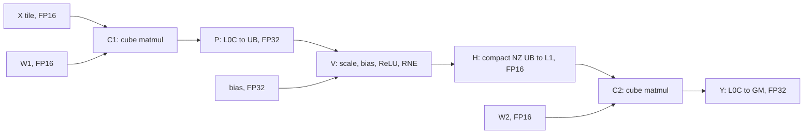

# From a CVC formula to a buffered schedule

Read [the generic pipeline method](pipeline-model.md) first. This worked case
anchors that method; the same reasoning applies to VCV, CVCV, VCVC and longer
graphs. For a new graph recalculate mappings and lifetimes instead of copying
all buffer depths. The derivation below assumes the handoff calls themselves are
known; they are on [cross-side handoff](cross-side-handoff.md). The runnable
[mixed-pipeline teaching demo](../../../kernels/ascriptor_kernels/tutorials/mixed_pipeline)
carries `serial`, `pipeline`, `resident_serial` and `resident` of each graph so a schedule can
be compared against a matched control. It records no measurement of its own; anything below
that is a number about time is yours to measure.

## Formula and dependency graph

The case computes FP32 `P = X @ W1`, then
`H = FP16_RNE(relu(FP32(P * 0.125) + bias))`, then FP32 `Y = H @ W2`.
Both matmuls use FP16 operands with FP32 accumulation. Keep H's rounding
boundary; fusion or scale movement must preserve the task's arithmetic.



C1 and C2 use the same cube compute resource. The two vector participants own
their row halves; they must publish matching physical halves before cube
consumption. Compact NZ has a physical panel pitch; a view does not repack it.

## Five related design questions

| Design | Question and evidence |
|---|---|
| Serial C1(i), V(i), C2(i) | Establish arithmetic, layouts, ownership and complete output first |
| Preload W2 | Can independent movement occur before the consumer needs it? This need not overlap compute |
| One-step lookahead | Can C1 publish a later item while consumers retain the previous one? Prove storage and drain |
| Resident weights | Are invariant W1/W2 rereads necessary? Sum weights and all buffered storage against L1 capacity |
| Multi-core plus local pipeline | How are items assigned, and how many remain per active core? Keep core owner and stage index separate |

This is a set of design directions, not a mandatory modification order.
[Cost analysis](roofline.md) selects worthwhile changes within allowed scope.
A one-core scheduling task does not authorize substituting a multi-core result.

## Logical one-step schedule

Put C1/V in the first group and C2 in the second:

```text
for t in range(N + 1):
    if t < N:
        C1(t); publish P(t)
        acquire P(t); V(t); publish H(t)
    if t > 0:
        i = t - 1
        acquire H(i); C2(i); store Y(i)
```

The first iteration issues C1/V to produce H(0); the final iteration lets C2
consume the last item. The first group uses t and the second uses i. CVCV adds
V2 after C2 in that second group; both traverse `N+1` rounds. At N=1 there is
no cross-item compute opportunity. The generic method derives longer/nonuniform
drains; adding one iteration blindly is not sufficient for every graph.

## Concrete lifetime table

The historical 128-row tile has two 64-row vector participants and N=128. Those two
participants are the cube core's pair of vector sub-blocks, and one 128-row tile becoming two
64-row ones is a `dual_mode=SPLITM` drain rather than a property of the graph — the same choice
exists at every `l0c_to_ub`, CVC or not, and `SINGLE` would give one participant all 128 rows
and the other none. See [device facts](facts-device.md#the-drain-into-the-vector-side-has-no-safe-default).
The table describes role boundaries; verify actual lowered readers before
tightening an event pipe. Both L0C families count against the same L0C capacity.

| Storage role | Producer | Last physical reader | Required lifetime / reuse |
|---|---|---|---|
| X and W1 in L1 | GM movement for C1(i) | C1 operand staging on MTE1 | Until operand staging retires; retained weights extend across all items |
| P in L0C | C1(i), M | L0C-to-UB publication, FIX | Through FIX read; next MMAD must not overwrite it early |
| P in each UB | FIX publication | V(i)'s final read, V | Through the V read; grouped issue still requires version protection until asynchronous completion |
| H in compact-NZ UB | V(i) register stores | UB-to-L1 movement, MTE3 | Through the actual copy; store predicate and physical pitch matter |
| H in L1 | Vector publication | C2 operand staging, MTE1 | Until the actual final L1 reader; use that proof before choosing a narrow release pipe |
| Y in L0C | C2(i), M | GM publication, FIX | Through output transfer; independent from P's L0C role |
| W2 in L1 | Prefetch or invariant load | C2 operand staging, MTE1 | Delayed item identity must match; resident weights live through the whole loop |

With the recorded physical shapes, double-buffered X/H plus two resident
weights used 192 KiB L1. Without residency, double-buffered X/W1/W2/H used
256 KiB L1. Two double-buffered FP32 128x128 L0C roles total 256 KiB. These
are example allocations, not universal minima or capacities. UB counting is
per vector participant, with its own pitch and all live roles.

Mutex depth-two permits two in-flight publications only when corresponding
physical versions exist. Different buffers need not share one depth. Increasing
every DBuff to TBuff can exhaust capacity without removing the critical wait.
The reverse reuse edge after the last reader is as important as data readiness.

## Observe the actual overlap

The actual recorded intersection was **C2(i) and V(i+1)**, although the source
first issues future C1 work. One measured model pair was:

| Task | Begin | End | Unit |
|---|---:|---:|---|
| V(1), union of its vector participants | 8385 | 8886 | model cycles |
| C2(0) | 8659 | 9238 | model cycles |
| Intersection | 8659 | 8886 | 227 model cycles |

Sixteen pairs gave 3632 cycles after unioning overlaps. DMA and synchronization
were excluded. Verify stage/item labels from actual task provenance; do not
infer them from Python source order or count the two vector lanes twice.

## Verify and generalize

Use one item, several items and more than one full slot wrap on the same core.
The historical cases have 1/3/8/17 full tiles and do not qualify tails. A new
tail domain requires independent masked/padded-boundary checks. Retain negative
controls for missing drain, wrong delayed index, early release and a fully
serialized-but-correct schedule when positive overlap is an agreed objective.

For VCV, VCVC or CVCV, redraw the dependency graph and lifetime table. For an
extra consumer, extend that input through its last read. For a recurrence,
preserve state order and associate delayed scalar values with their consumers.
The [teaching and evaluation routes](../practice.md) distinguish numerical,
synchronization, overlap and hardware-performance evidence.
