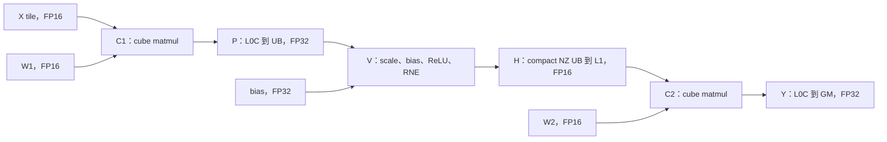

# 从 CVC 公式推导缓冲流水

先读[通用流水方法](pipeline-model.md)。本案例将方法落到具体工作，VCV、CVCV、VCVC
和更长图仍使用同一推导过程；换图后重算映射与生命周期，不复制所有 buffer 深度。
下面的推导假定交接调用本身已经知道；调用见[跨侧交接](cross-side-handoff.md)。
[混合流水教学 demo](../../../kernels/ascriptor_kernels/tutorials/mixed_pipeline)给每个图都
备了 `serial`、`pipeline`、`resident_serial`、`resident`，可以拿排程和匹配对照相比。它本身
不记录任何测量值；下文凡是关于时间的数字，都要你自己测。

## 公式与依赖图

案例先计算 FP32 `P = X @ W1`，再计算
`H = FP16_RNE(relu(FP32(P * 0.125) + bias))`，最后计算 FP32 `Y = H @ W2`。
两次 matmul 都以 FP16 操作数、FP32 累加执行。保留 H 的 rounding 边界，融合或移动 scale
必须符合任务算术契约。



C1/C2 使用同一 cube 计算资源。两个 vector 参与者分别拥有半块行，必须在 cube 消费前
按匹配的物理半块完成发布。Compact NZ 有物理 panel pitch，view 不会自行重新打包。

## 五个相互关联的设计问题

| 设计 | 要回答的问题与证据 |
|---|---|
| 串行 C1(i)、V(i)、C2(i) | 先建立算术、layout、归属和完整输出 |
| W2 预取 | 独立搬运能否提前到消费者需要之前？它不一定产生计算重叠 |
| 一步 lookahead | C1 提前发布新项时能否保留前项供消费者使用？证明存储与 drain |
| 权重驻留 | W1/W2 重读是否必要？权重与全部缓冲共同计入 L1 容量 |
| 多核与核内流水 | 如何分配，每活跃核剩几项？核间 owner 和 stage 索引分开 |

这些是设计方向，不要求逐项修改。按[成本分析](roofline.md)在允许范围内选择有收益空间的
改动。单核排程题不能用多核结果替代。

## 一步 lookahead 的逻辑顺序

将 C1/V 放在第一组、C2 放在第二组：

```text
for t in range(N + 1):
    if t < N:
        C1(t); 发布 P(t)
        获取 P(t); V(t); 发布 H(t)
    if t > 0:
        i = t - 1
        获取 H(i); C2(i); 写回 Y(i)
```

首轮发射 C1/V 生成 H(0)，末轮由 C2 消费最后一项。第一组使用 t 索引，第二组使用 i。
CVCV 在第二组 C2 后加入 V2 即可；两者都使用 `N+1` 轮。N=1 没有跨项计算机会。
更长或非均匀流水由通用方法逐阶段推导 drain，不能机械地只增加一轮。

## 具体生命周期表

历史案例每 tile 128 行、N=128，每个 vector 参与者拥有 64 行。那两个参与者就是这个 cube core 配对的两个 vector sub-block；一个 128 行的 tile 变成两个 64 行的，是一次 `dual_mode=SPLITM` 的排空，**不是这张图自带的性质**——同一个选择存在于每一处 `l0c_to_ub`，与是不是 CVC 无关，而 `SINGLE` 会把 128 行全给其中一个参与者、另一个什么都不做。见[设备事实](facts-device.md#排到向量侧这一步没有安全的默认值)。下表描述角色边界；缩短
事件 pipe 前核对实际 lowered reader。两个 L0C family 共同占用 L0C 容量。

| 存储角色 | Producer | 最后物理 reader | 生命周期与复用 |
|---|---|---|---|
| L1 中的 X/W1 | C1(i) 的 GM 搬入 | C1 的 MTE1 操作数搬运 | 保留至搬运退役；常驻权重跨所有项 |
| L0C 中的 P | C1(i)，M | L0C 到 UB，FIX | 保留至 FIX 读取完成，后续 MMAD 不提前覆盖 |
| 每个 UB 中的 P | FIX 发布 | V(i) 最后读取，V | V 读取完成后回收；同组发射仍需按异步完成约束保护版本 |
| Compact-NZ UB 中的 H | V(i) register store | UB 到 L1，MTE3 | 保留至实际 copy；考虑 predicate 和物理 pitch |
| L1 中的 H | Vector 发布 | C2 的 MTE1 操作数搬运 | 最后 L1 reader 完成后回收，有证据才缩短释放 pipe |
| L0C 中的 Y | C2(i)，M | GM 写回，FIX | 输出搬运完成前保留，独立于 P 的 L0C 角色 |
| L1 中的 W2 | 预取或不变输入加载 | C2 的 MTE1 操作数搬运 | 对齐延迟 item；驻留版本跨整个循环 |

历史物理形状下，X/H 双缓冲加两份常驻权重共 192 KiB L1；X/W1/W2/H 全部双缓冲时为
256 KiB L1。两个 FP32 128x128 L0C 角色各双缓冲，共 256 KiB L0C。这些是示例分配，
不是通用最小值或设备容量。UB 按每个 vector 参与者分别统计，包含 pitch 和全部 live 角色。

深度为二的 mutex 仅在存在对应物理版本时允许两次在途发布。不同 buffer 不必同深度。
全部 DBuff 改成 TBuff 可能耗尽容量却没有消除关键等待。最后 reader 后的反向复用边
与数据 ready 一样必须证明。

## 观察真实重叠

源码提前发射 C1，实际记录的交集却是 **C2(i) 与 V(i+1)**。其中一对模型区间如下：

| 工作 | 开始 | 结束 | 单位 |
|---|---:|---:|---|
| V(1)，对应 vector 参与者的并集 | 8385 | 8886 | 模型 cycles |
| C2(0) | 8659 | 9238 | 模型 cycles |
| 交集 | 8659 | 8886 | 227 模型 cycles |

十六组交集求并后为 3632 cycles，排除了 DMA 和同步。Stage/item 标签来自实际 task
provenance，不能按 Python 源码顺序猜测，也不能将两个 vector lane 重复相加。

## 验证与泛化

同一 core 覆盖单项、多项和超过一整轮 slot 周转。历史案例是 1/3/8/17 个完整 tile，未验证
tail；新 tail domain 需补独立 mask/padding 边界检查。保留漏 drain、延迟索引错误、提前
release 的负例；要求正重叠时，还需识别数值正确但完全串行的排程。

改为 VCV、VCVC、CVCV 时重画依赖图和生命周期表；增加 consumer 时延长输入寿命；
递推保持状态顺序，延迟标量跟随消费者。[练习与评估](../practice.md)分别记录数值、
同步、计算重叠与硬件性能证据。
